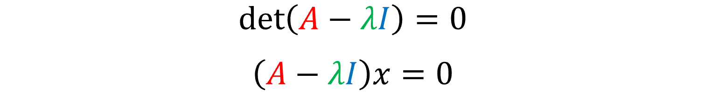

```{r setup, include=FALSE}
options(htmltools.dir.version = FALSE)
library(knitr)
knitr::opts_chunk$set(warning = FALSE, message = FALSE)
# options(knitr.table.format = "html")
library(tidyverse)
library(babynames)
library(fontawesome) 
library(DiagrammeR)
```

layout: true
  
<div class="my-footer"><span>quinference.com</span></div>

```{r xaringan-logo, echo=FALSE}
xaringanExtra::use_logo(
  image_url = "img/redlogo.png"
)
```

```{r xaringanExtra, include = FALSE}
xaringanExtra::use_xaringan_extra(c("tileview", "webcam","panelset","tachuyon"))
```

---
name: ATL-title
class: inverse,left, middle
background-image: url(img/title-slide-img.png)
background-size: cover

# Algorithmic Trading and Investing (FIN7030)

# .fancy[Lecture 3: Extracting signal from noisy data]

.large[Barry Quinn PhD CStat | Queen's Management School | `r Sys.Date()`]

<!-- this ends up being the title slide since seal = FALSE-->

---
class:inverse
# Learning outcomes 
- .large[Growth learning of mathematics]
- .large[The Jewel of the Matrix: Eigenvalues and Eigenvectors]
- .large.fancy[Mining the Jewel]
  -   .large[Marcenko-Pastur Theorem]
  - .large[Denoising and detoning financial covariance matrices]
  
- .large.fancy[Breathing breaks to aid learning]
---
class: inverse
## Teaching mathematical concepts

- Understanding machine learning requires familiarity with many simple mathematical concepts
- The goal of this course is to build your intuition about these notions without getting overly technical
- In particular I will limit mathematical notation , which can be off-putting for those without any mathematics background and isn't strictly necessary to explain things well.
- Instead we will visual concepts through code, conversation and real-world applications
- Mostly, we will use coded practical example to illustrate the concepts
- This is a .large.fancy[**learning by doing**] approach when you can play around with the code yourself you understand underlying concepts
---
class: middle
# Why study denoising and detoning?

- .large[Covariance matrices are everywhere in finance.]
- .large[Empirical covariances measure the linear co-movement between a set of random variables]  
- .large[For example to estimate the linear comovement between FTSE 100 stocks you would gather 100 time series of each stocks returns]
- .large[They are used to:]

1. Run regressions
2. Estimate risk
3. Optimise portfolios
4. Simulate scenarios via Monte Carlo
5. Find clusters
6. Reduce the dimensionality of a set of potential predictors

---
class:middle
## The story of the billion dollar eigenvector

- .heatinline[Larry page and Sergy Bin built a  dollar company based on solving a linear alegbra problem using eigenvectors]
- In the following clip, Professor Steve Strogatz tells the story of the eigenvector, and its billion dollar application in Google.


<iframe height="300", width="500" scrolling="no" frameborder="yes" allow="autoplay" src="https://w.soundcloud.com/player/?url=https%3A//api.soundcloud.com/tracks/302257938&color=%23d0aca4&auto_play=false&hide_related=false&show_comments=true&show_user=true&show_reposts=false&show_teaser=true&visual=true"></iframe><div style="font-size: 10px; color: #cccccc;line-break: anywhere;word-break: normal;overflow: hidden;white-space: nowrap;text-overflow: ellipsis; font-family: Interstate,Lucida Grande,Lucida Sans Unicode,Lucida Sans,Garuda,Verdana,Tahoma,sans-serif;font-weight: 100;"><a href="https://soundcloud.com/edwardoneill" title="edwardoneill" target="_blank" style="color: #cccccc; text-decoration: none;">edwardoneill</a> · <a href="https://soundcloud.com/edwardoneill/steven-strogatz-on-teaching-eigenvectors-and-eigenvalues" title="Steven Strogatz on Teaching Eigenvectors and Eigenvalues" target="_blank" style="color: #cccccc; text-decoration: none;">Steven Strogatz on Teaching Eigenvectors and Eigenvalues</a></div>

---
class:middle
## The `r  fa(name="gem")` of financial matrices: *Eigenvalues* and *eigenVectors*

- As discussed, the financial world is increasing becoming defined by *Big Data*, and data-driven decision making.
- As everything becomes defined by data, they are stored in matrices
- Success in the rapidly evolving quant finance industry increasing requires creative analytics and communications of complex and complication matrix-stored data.
- At the center of the matrix, through the complexities, lie its `r fa(name = "gem")` the eigenvector and eignenvalues.
- The provide clarity and the true signal in the noisy data.
- Understand what they are is vital to be successful in modern finance. 
---
class:middle
# Deep dive: What is a matrix?
.left-column[

]
.right-column[
- One of the simplest matrix forms is a two-dimensional vector.
- It has two elements which each correspond to one coordinate on the two-dimensional plane.
-  For example each of the following vectors represent a movement on the y and x planes 
]

---
class:middle
# Deep dive: Matrix are linear transformers
.left-column[

]
.right-column[
- In the matrix world, a linear transformation is performed by multiplying a vector by a matrix.
- Visually, the effect is to stretch (or squish) the coordinate system along two vectors
- For example the linear transformation matrix $\begin{bmatrix} 3 & 1 \\ 1 & 2 \end{bmatrix}$ aligns the x-axis along the vector $\begin{bmatrix} 3&1 \end{bmatrix}$ (the first column) and the y-axis along the vector $\begin{bmatrix} 1&2 \end{bmatrix}$
.heatinline[The red lines show the transformation aligned to the y-axis]
.saltinline[The blue lines show the transformation aligned to the x-axis]
]

---
middle:class
# Deep dive: What are eigenvectors and eigenvalues?
.left-column[

]
-right[
- Consider the vector  $\begin{bmatrix} -1&-1 \end{bmatrix}$ in the below figure
- After it is multiplied by the linear transformation matrix, it lands on the point $\begin{bmatrix} -4&-3 \end{bmatrix}$
.saltinline[A vector's span is the line that runs through the vector forever]
.saltinline[When a vector undergoes a linear transformation usually it is knocked off of its span]
.bg-washed-green.b--dark-green.ba.bw2.br3.shadow-5.ph4.mt5[
*Eigenvectors* are vectors that do not get knocked off their span.  Instead, when eigenvectors are multiplied by a matrix, the eigenvector is simply scaled by a factor of the *eigenvalue*, landing somewhere else along the span
]
]

---
class:middle
# Deep dive: Eigenvectors explained
.pull-left[

 - Eigenvectors and eigenvalues are seldom whole numbers and challenging to calculate with accuracy
]
.pull-right[
- The nature of eigenvectors means that scaling an *Original* eigenvector in the same or directly opposite direction will yield yet another *scaled* eigenvector

]

---
class:top,left
# Deep dive: The world in 3-dimensions
.pull-left[
- In 3-D, the matrix describes a transformation of 3 axes, x, y and z, corresponding to the three coordinates that represent the transformation each coordinate undergoes.
- For this reason, *eigenvectors* and *eigenvalues* are only defined for square matrices

]
.pull-right[
- In order to find the eigenvector of a matrix, we need to find the eigenvalue
- From the definition of the eigenvalue, we can construct an equality $Ax=\lambda x$, where $A$ represents the matrix and $\lambda$ represents the eigenvalue.

.saltinline[The logic of this equality is that multiplying the eigenvector by the transformation matrix $x$ should have the same effect as scaling it by eigenvalue $\lambda$]
]
.footnote.mid-gray[A square matrix is a general $n$ by $n$ matrix describing the transformation of $n$ axes, each corresponding to a coordinate with $n$ elements]
---
class:top
## Deep dive: Calculating the eigenvector and eigenvalue
.pull-left[


]
.pull-right[
- Rearrange the equality to make all terms on the right side (A is a matrix and $\lambda$ is a number so we have to an identity matrix $I$ which applies no transformation at all) to find a solution fo the eigenvalue.

- As the previous plot shows, there are infinite number of *trivial solutions*, or solutions that can be achieved simply by scaling an eigenvector by any number.

- In order to get rid of trivial solutions, we use the .red[determinant].
]
---
class:middle
## Deep dive: What is a determinant?
```{r squareunit, echo=FALSE, fig.cap="Figure 1",out.width="50%",fig.align='left'}
knitr::include_graphics(path="img/squareunit.png")
```

```{r squareunit, echo=FALSE, fig.cap="Figure 1",out.width="50%",fig.align='right'}
knitr::include_graphics(path="img/4squnits.png")
```

- The .red[determinant] is a measure of the factor in which area is stretched by a transformation matrix.

- Figure 1 shows one standard square on the coordinate space, with an area of one square unit.

- When the space is stretched $\begin{bmatrix} 2&1\\0 &2\end{bmatrix}$ , the new area is four square units

- **Because the area increases by a factor of four, the determinant of the matrix is four**
---
class:middle
## Deep dive: What is the determinant is zero?

- When the determinant is zero, the area of the square is collapsed to zero, meaning that the two vectors describing the locations of the axes are on the same line.

- .heatinline[when the determinant equals zero all of space is warped into one single line (one-dimensional)]

.heat[Therefore to make the previous equality easily solvable (by discarding the space of redundant or trivial solutions) it must be true that the determinant of the matrix must be equal to zero]

---
class:middle
## Deep dive: Get ready for the math! 
.left-column[
`r emo::ji("confused")`
]
.right-column[
```{r squareunit, echo=FALSE, fig.cap="Figure 3",out.width="50%",fig.align='right'}
knitr::include_graphics(path="img/detcalc.png")
```
- In 2-D finding the eigenvalue is then a task of solving a quadratic
- Figure 3 shows that the eigenvalues of the matrix $\begin{bmatrix}1&4\\3&2\end{bmatrix}$ are 5 and -2
- This means that when the eigenvectors of the matrix are multiplied by the matrix, their vector length will be stretched by a factor of 5 and -2, respective to each of the eigenvectors
]

.footnote[.red.bold[ For three or more dimension matrice, a different form of the determinant formula must be used]]
---
class:middle
## Deep dive: Even more math!
.left-column[
`r emo::ji("confused")`
]
.right-column[
```{r squareunit, echo=FALSE, fig.cap="Figure 4",out.width="50%",fig.align='right'}
knitr::include_graphics(path="img/detcalc1.png")
```
- By plugging in the discovered eigenvalues into our originally derived equation, we find the eigenvectors
- In the case of the calculation in figure 4, when we plug in $\lambda=5$ we get $x=\begin{bmatrix}1\\1\end{bmatrix}$
- When we plug in when we plug in $\lambda=-2$ we get $x=\begin{bmatrix}-4\\3\end{bmatrix}$

.heatinline.bold[Given only the eigenvectors and eigenvalues of any matrix, one can easily completely reconstruct the original matrix]

.saltinline.bold[This special property guarantees that eigenvectors will show up in almost all financial data science problems]

]
---
class:middle
## Deep dive: Machine learning and Eigenvectors
- Principal component analysis (PCA) is a common unsupervised machine learning technique that seeks to reduce the dimensionality of data whilst retaining key statistical measures like variance and mean.

- Consider a financial data set with 100 features (100-Dimensions), we can attempt to reduce this to 2-D using PCA.

-Firstly, the algorithm constructs the covariance matrix, which evaluates (in a sense) how correlated two variables are.

- This matrix as a whole defines the **shape** of the data.

.footnote[We see come across this **shape** concept again when we using code.]

---
class:middle
## Deep dive: Machine learning and eigenvectors

---
class:middle
## Deep dive: the
---

class: middle,center
background-image: url(img/title-slide-img.png)
background-size: cover
# A breathing break

<iframe width="560" height="315" src="https://www.youtube.com/embed/cEqZthCaMpo" frameborder="0" allow="accelerometer; autoplay; clipboard-write; encrypted-media; gyroscope; picture-in-picture" allowfullscreen></iframe>

---
class: middle 
# Why study denoising and detoning?

- .large[Empirical covariance matrices are estimated with flawed, incomplete data which leads to estimates with an amount of noise]

- .large[Such noise can render calculations using covariance matrix estimates useless]

 .large[ In finance, we need a procedure to reduce this noise and enhance the signal **before** using in subsequent analysis like those listed previously]

---
class: middle
# Denoising using the Marcenko-Pastur Theorem
- This is an elegant mathematical theorem that can help *denoise* data by distinguishing random from non-random from nonrandom by means of the empirical correlation matrix of the data.

- The probability density function (pdf) of a Marcenko-Pastur distribution produces a set of eigenvalues which are randomly distributed.

- We can exploit this property to extract the non-random component of some empirical correlation matrix, thus removing the random noise.

.heat.fancy[Our goal is to learn how to discriminate between eigenvalues associated with noise components and eigenvalues associated with signal components]

---
class: top
## The Marcenko-Pastur Theorem in Python
.panelset[
.panel[.panel-name[ Set-up]
```{r set-up}
library(reticulate)
matplotlib <- import("matplotlib")
matplotlib$use("Agg", force = TRUE)
```

- *Insert Python code chunk in RMarkdown file*

```{python}
import numpy as np
import pandas as pd
import matplotlib.pyplot as plt
from sklearn.neighbors.kde import KernelDensity
```

]
.panel[.panel-name[Define Python functions to test theorem]

```{python}
# ------------------------------
def mpPDF(var,q,pts):
  eMin,eMax=var*(1-(1./q)**.5)**2,var*(1+(1./q)**.5)**2
  eVal=np.linspace(eMin,eMax,pts)
  pdf=q/(2*np.pi*var*eVal)*((eMax-eVal)*(eVal-eMin))**.5
  pdf=pd.Series(pdf,index=eVal)
  return pdf
```

- This function is a principal component analysis function which will extract the Eigenvalues (principal components)
```{python}
def getPCA(matrix):
# Get eVal,eVec from a Hermitian Matrix
  eVal,eVec=np.linalg.eigh(matrix) # complete Hermitian (conjugate symmetric) or real symmetric matrix
  indices=eVal.argsort()[::-1] # arguments for sorting eVal in descending order
  eVal,eVec=eVal[indices],eVec[:,indices]
  eVal=np.diagflat(eVal) # indentity matrix with eignvalues as diagonal
  return eVal,eVec
```

- This function create a pdf for a series of supplied observations (obs)

```{python}
##---------------
def fitKDE(obs,bWidth=.25,kernel='gaussian',x=None):
# Fit kernel to a series of obs, and derive the probability of obs
# x is the array of values on which to fit KDE will be evaluate
  if len(obs.shape)==1:obs=obs.reshape(-1,1)
  kde=KernelDensity(kernel=kernel,bandwidth=bWidth).fit(obs)
  if x is None:x=np.unique(obs).reshape(-1,1)
  if len(x.shape)==1:x=x.reshape(-1,1)
  logProb=kde.score_samples(x) # log of probability density
  pdf=pd.Series(np.exp(logProb),index=x.flatten())
  return pdf
```
]
.panel[.panel-name[Test the theorem]

```{python}
# Create a random sample for testing
N = 100
T = 1000
x=np.random.normal(0,1,size=(T,N))
cor=np.corrcoef(x,rowvar=0)
eVal0,eVec0=getPCA(cor)
pdf0=mpPDF(1.,q=x.shape[0]/float(x.shape[1]),pts=N) # Marcenko-Pastur pdf
pdf1=fitKDE(np.diag(eVal0),bWidth=.005) # empirical pdf
```
]
.panel[.panel-name[Visualising Marcenko-Pastur theorem]
.pull-left[
```
fig = plt.figure(figsize=(3,2))
plt.plot(pdf0.keys(), pdf0, color='r', label="Marcenko-Pastur pdf");
plt.plot(pdf1.keys(), pdf1, color='g', label="Empirical:KDE");
plt.legend(loc="upper right");
plt.show()
```
]
.pull-right[
```{python, echo=FALSE}
fig = plt.figure(figsize=(8,6))
plt.plot(pdf0.keys(), pdf0, color='r', label="Marcenko-Pastur pdf");
plt.plot(pdf1.keys(), pdf1, color='g', label="Empirical:KDE");
plt.legend(loc="upper right");
plt.show()
```
]
]
]
---
class:middle

# Random Matrix with Signal
.panelset[
.panel[.panel-name[Explanation]
- In finance we are like to have a correlation matrix which is a mix of eigenvectors which are random and non-random (the signal)
- The code snippet builds a *fake* financial data covariance matrix that us not perfectly random.
- This *fake* data will only approximate the Marcenko-Pastur PDF, provides a way to extract the signal.
- Out of the `nCols` random variables that form the covariance matrix generated by `getRndCov`, only `nFact` contain some signal
- To weaken the signal (and make it more typical of financial data) we add that covariance matrix to a **purely random** matrix, with weight `alpha`
]
.panel[.panel-name[Python set-up]
```{python}
def getRndCov(nCols, nFacts): #nFacts - contains signal out of nCols
    w = np.random.normal(size=(nCols, nFacts))
    cov = np.dot(w, w.T) #random cov matrix, however not full rank
    cov += np.diag(np.random.uniform(size=nCols)) #full rank cov
    return cov

def cov2corr(cov):
    # Derive the correlation matrix from a covariance matrix
    std = np.sqrt(np.diag(cov))
    corr = cov/np.outer(std,std)
    corr[corr<-1], corr[corr>1] = -1,1 #for numerical errors
    return corr
    
def corr2cov(corr, std):
    cov = corr * np.outer(std, std)
    return cov

```
]
.panel[.panel[Create random matrix with signal]
```{python}
alpha, nCols, nFact, q = .995, 1000, 100, 10
pdf0 = mpPDF(1., q=x.shape[0]/float(x.shape[1]), pts=N)
cov = np.cov(np.random.normal(size=(nCols*q, nCols)), rowvar=0) #size = (1000*10,1000)
cov = alpha*cov+(1-alpha)*getRndCov(nCols, nFact) # noise + signal
corr0 = cov2corr(cov)
eVal01, eVec01 = getPCA(corr0)
```
]
]
---
class:top
# Fitting the Marcenko-Pastur Distribution
.panelset[
.panel[.panel-name[Explanation]
- The objective is to fit the MP distribution to find the variance value which minimises the sum of the squared differences between the analytical PDF and the kernel density estimate (KDE) of the observed eigenvalues
- The following code will report three important values:
- `eMax0`: the maximum expected eigenvalue beyond which the data is nonrandom
- `var0`: the variance value that minimises the sum of the square differences above
- `nFacts0`: the number of factors
]
.panel[.panel-name[Code to fit the MP pdf]
```{python}
from scipy.optimize import minimize
#Fit error
def errPDFs(var, eVal, q, bWidth, pts=1000):
    var = var[0]
    pdf0 = mpPDF(var, q, pts) #theoretical pdf
    pdf1 = fitKDE(eVal, bWidth, x=pdf0.index.values) #empirical pdf
    sse = np.sum((pdf1-pdf0)**2)
    print("sse:"+str(sse))
    return sse 
    
# find max random eVal by fitting Marcenko-Pastur dist
# and return variance
def findMaxEval(eVal, q, bWidth):
    out = minimize(lambda *x: errPDFs(*x), x0=np.array(0.5), args=(eVal, q, bWidth), bounds=((1E-5, 1-1E-5),))
    print("found errPDFs"+str(out['x'][0]))
    if out['success']: var = out['x'][0]
    else: var=1
    eMax = var*(1+(1./q)**.5)**2
    return eMax, var
```

]
.panel[.panel-name[Find optimal values]
```{python}
# Find optimal values
eMax0, var0 = findMaxEval(np.diag(eVal01), q, bWidth=.01);
nFacts0 = eVal01.shape[0]-np.diag(eVal01)[::-1].searchsorted(eMax0);
pdf0 = mpPDF(var0, q=x.shape[0]/float(x.shape[1]), pts=N)
pdf2=fitKDE(np.diag(eVal01),bWidth=.005)
```
]
.panel[.panel-name[Visualise results]
```{python include=FALSE}
# Plot results
fig = plt.figure()
ax  = fig.add_subplot(111)
hist_data=np.diag(eVal01)
ax.hist(hist_data, density = True, bins=50); # Histogram the eigenvalues
plt.plot(pdf0.keys(), pdf0, color='r', label="Marcenko-Pastur pdf");
# plt.plot(pdf1.keys(), pdf1, color='g', label="Empirical:KDE");
plt.plot(pdf2.keys(), pdf2, color='b', label="Eigenvalues of random-matrix with signal");
plt.legend(loc="upper right");
```

```
# Plot results
fig = plt.figure()
ax  = fig.add_subplot(111)
hist_data=np.diag(eVal01)
ax.hist(hist_data, density = True, bins=50); # Histogram the eigenvalues
plt.plot(pdf0.keys(), pdf0, color='r', label="Marcenko-Pastur pdf");
# plt.plot(pdf1.keys(), pdf1, color='g', label="Empirical:KDE");
plt.plot(pdf2.keys(), pdf2, color='b', label="Eigenvalues of random-matrix with signal");
plt.legend(loc="upper right");
```
```{python}
plt.show()    
```

]
]
---


