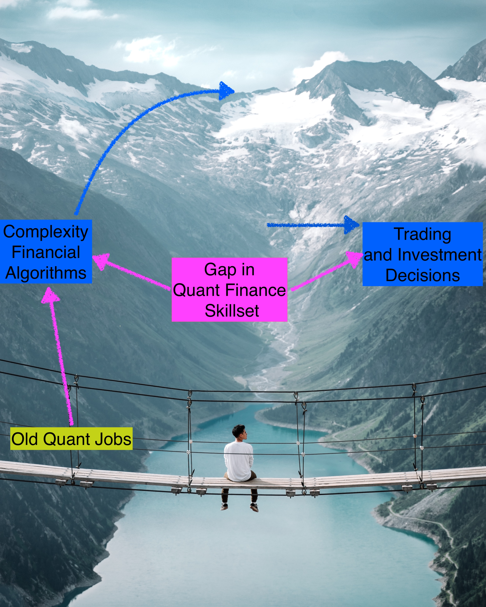

  
```{r setup, include=FALSE}
options(htmltools.dir.version = FALSE)
library(knitr)
knitr::opts_chunk$set(warning = FALSE, message = FALSE)
# options(knitr.table.format = "html")
library(tidyverse)
library(babynames)
library(fontawesome) 
library(DiagrammeR)
library(xaringanExtra)
library(timevis)
library(htmltools)

knitr::knit_hooks$set(time_it = local({
  now <- NULL
  function(before, options) {
    if (before) {
      # record the current time before each chunk
      now <<- Sys.time()
    } else {
      # calculate the time difference after a chunk
      res <- difftime(Sys.time(), now)
      # return a character string to show the time
      paste("Time for this code chunk to run:", res)
    }
  }
}))
```

layout: true
  
<div class="my-footer"><span>quinference.com</span></div>

```{r xaringan-logo, echo=FALSE}
use_logo(
  image_url = "img/redlogo.png"
)
```

```{r xaringanExtra, echo=FALSE}
use_xaringan_extra(c("tileview", "webcam","panelset","tachuyon"))
```

---
name: ATL-title
class: inverse,left, middle
background-image: url(img/title-slide-img.png)
background-size: cover

# Algorithmic Trading and Investing (FIN7030)


# .fancy[Lecture 2: High performance cloud computing in finance]

.large[Barry Quinn PhD CStat | Queen's Management School | `r Sys.Date()`]

<!-- this ends up being the title slide since seal = FALSE-->

---
class:inverse
# Outline 

- .salt[What is cloud computing?]
- .fat[Your Turn: Introduction to the QMS_HPCC]
- .salt[Taxonomy of parallel computing]
- .fat[Performance computing in Python]
- .salt[Financial applications in the cloud]
- .salt[Economics of the cloud computing]
- .salt[Some case studies]
---
class:middle
## Cloud computing intro
- This course will expose you to the flexibility of cloud computing and combining R and Python.
- The School has a high performance compute virtual machine, set-up in Microsoft Azure.
- Financial institutions have a long history of heavily investing in technology for gaining market share and defending their current position.
- The democratisation of computing processing power by cloud providers, has lead to an explosion in financial machine learning applications.
- Today technology that would have costed millions 20 years ago can be rented for thousand from these cloud providers

>Meriwther spent $20 million on a state-of-the-art computer system and hired a crack team of financial engineers to run the show at LTCM..... 
`r tufte::quote_footer('Scott Patterson, The Quants, 2010')`
---
class: middle
# What is cloud computing ?
- .heat[Cloud computing shares many of the similarities of electricity]

.center.large[In the early days of electrical power, corporations and factories where powered by on-site small-scale power plants. Today, large scale power plants with efficient transmission networks have powered modern industrial society, allowing electricity to be at everyone's disposal ar reasonable prices]

- .heat[Much like electricity the core concept of cloud computing is resource sharing]
---
class: top
# What is cloud computing ?

.fat[definitions:]

>A model for enabling ubiquitious, convenient, on-demand network access to a shared pool of configurable computing resources (e.g., networks, servers, storage, applications, and services) that can be rapidly provisioned and released with minimal management effort or server provider interaction

`r tufte::quote_footer("National Institute of Standards and Technology(NIST) of the US Department of Commerce, 2019")`

>Simply put, cloud computing is the delivery of computing services – including servers, storage, databases, networking, software, analytics and intelligence – over the Internet (**"the cloud"**) to offer faster innovation, flexible resources and economies of scale. Typically, you only pay for cloud services you use, helping you lower your operating costs, run your infrastructure more efficiently and scale as your business needs change.

`r tufte::quote_footer("Beginners guide to cloud computing, Microsoft Azure, 2020")`

---
class:top
## Essential characteristics of cloud computing solutions
.heatinline[The follow distinguish cloud computing from other solutions, such as on-site high performance computing servers]

- .large.fancy[On-demand self-service] 
  - A consumer can provision computing capacity as needed without interaction with service provider.
- .large.fancy[Broad network access]
  - Computing resources are available to the consumer through the network and can  be accessed fro mobile phones, tablets, laptops, and workstations.
- .large.fancy[Resource pooling]
  - Resources are dynamically assigned to customers' needs.
- .large.fancy[Rapid elasticity]
  - Capacities can be reconfigured automatically to scale rapidly in response to the changing demand.
- .large.fancy[Measured service]
  - The resource utilisation is automatically controlled and optimised by the cloud systems.  The usage is monitored, measured, and reported.

---
class: middle
## Why high performance computing and why now?
.salt[Regulatory response to the flash crash of 2010]
> On the 6th May, 2010 at 2.45 p.m.(EST), the US stock market experienced a nearly 10% drop in the Dow Jones Industrial Average, only to recover most of ther loss a few minutes later

.saltinline[It took the regulatory agencies (SEC) five months to come up with an investigation report on this crash]

.heatinline[In the congressional hearings after the event, the SEC official give the primary reason for the long delay as the volumne of data to be investigated (~20 terabytes)]

.heatinline[HPC scientific computing systems such as the National Research Scientific Computing center(NERSC). routinely work with hundreds of terrabytes in minutes]

.heatinline[After the congressional hearing Lawrence Berkley National Laboratory (LNBL) established the Computational Intelligence and Forecasting Technologies (CIFT) project to promote HPC tools and techniques for analysing of financial times series data]
---
class:top
.large.center[Evolution of financial problem complexity and cloud computing]

```{r cloud_timeline, echo=FALSE,out.width="100%",out.height="50%"}
c("Black-Scholes-Merton<br>options pricing model", 
              "Stochastic modelling<br>of volatility"  ,
              "Jump diffusion models",
              "Flash Crash",
              "Basel III",
              "Rebentrost et al.2018<br> propose a quantum computational<br> algo to price derivatives",
              "CME Smart Stream launched:<br> First derivatives exchange<br>to offer real-time cloud-based market data",
              "Late Professor JohnMcCarthy (MIT) suggested<br>computing would be sold as a utility",
              "IBM virtualised <br> operating systems",
              "APRANET <br> launched",
              "Nearly 100,000 computers connected to the internet",
              "World Wide Web launched; 1 million<br>computers connected to the Internet",
              "Compaq Computer Corp.introduce an<br>'An Internet Divisions Strategy for Cloud Computing'",
              "Amazon Web Services (AWS) launch public Cloud",
              "OpenNebula research project launched; 'Big data'starts to become popular",
              "Amazon launch Elastic Compute Cloud (EC2)",
              "Dropbox founded; Cloud storage becomes a service",
              "Microsoft launch Azure",
              "DigitalOcean launched; third largest cloud computing company (2020)",
              "Real-time streaming data processed on AWS",
              "Machine learning services on the Cloud",
              "Microsoft launches under the sea data-centre",
              "Google Tensor Processing Units (TPUs) avaliable on the Cloud")-> content
start   = c("1973","1993","2000","2010","2013","2018","2019","1961","1967","1969","1988","1991","1996","2002","2005","2006","2007","2010","2012","2013","2015","2018","2019")

timevis(data.frame(
  start=start,
  content =content ,
  group=c(rep(1,7),rep(2,length(content)-7)),
  style=c(rep("font-size: 0.5em; color: blue;",7),rep("font-size: 0.5em; color: red;",length(content)-7))),
  groups = data.frame(id = 1:2, content = c("Finance<Br> Computational<br>Milestones","Cloud<br>Computing<br>Milestones")),
  fit=TRUE)->tv


style = ".vis-timeline { 
border-color: #269026;
  background-color: lightblue;
  font-size: 12px;}
.vis-item {
  border: 2px solid #5ace5a;
  font-size: 10pt;
  background: #d9ffd9;
  font-family: lucinda console;
  padding: 2px;}"

tv <- tagList(tags$style(style), tv)
tv
```
---

class: middle
## QMS Remote analytics Platform (Q-RaP)

- We have recently introduced state-of-the-art cloud computing teaching for the masters students in the Management School

- We have built a high-performance virtual machine in the Azure cloud to expose students to the production-level technologies they will experience in industry.

- SPECIFICATION: A Linux (ubuntu 18.04) operating system (the most popular OS) with 64 vCPUs, 256 GiB of RAM and 100gb of vSSD.

- This will allows us to teach 64-128 students concurrently (with toy computational tasks with each student limited to 1vCPU and 5 GiB RAM)

---
class:middle
# Skills and knowledge in Quant Finance Industry



---
class:middle
# Q-RaP software

- To help fill this gap we will be using the last production level software on the Q-RaP


- Programming language knowledge is like a fashion accessory to geeks

<i class="fab fa-r-project"></i>


- When first learning to code it is much better to learning how to integrate languages on a agile platform.


- The user interface on the server will be power by Rstudio Team Product, the industry version of the free Rstudio IDE for R.

- Learning to integrate programming languages as a quant finance professional be the communicative bridge between complex models and financial decisions

- From this product suite we will be using RStudio Server Pro and RStudio connect

- In this course we will be using a cloud-based Linux machine running [RStudio Server Pro](https://rstudio.com/products/rstudio-server-pro/)
>Rstudio Server Pro us the preferred data analysis and integrated development experience for professional R users and data science teams who use R and Python. `r tufte::quote_footer("RStudio Team, 2020")`

---
class:top,center
# Accessing the server

.pull-left[ 
### Steps
1. Open a web browser
2. Navigate to: http://qms.uksouth.cloudapp.azure.com:8787/
3. login using the credential provided
]
.pull-right[ 


]
---
class:middle
# Taxonomy of parallel computing
- Computer processors process instructions sequentially.
- Traditional computing problems are serial by design.
- The birth of multiprocessors (*multicore processors*) has innovated a new type of computing problem:

.acid.center[how to utilise the parallel structure]
- Roughly speaking, multicore processors are equivalent to running multiple computers at a time
---
class:middle
# Taxonomy of parallel computing
.pull-left.acid[Parallel computing problems in contrast to serial computing problems, refer to the type of problem that can be divided into small Jobs which can be processed simultaneously ]
.pull-right[
**embarrassingly parallel computing**:
```{r embar_parallel,echo=FALSE}
DiagrammeR::grViz("
digraph rmarkdown {
'Input Data'->{Job1,Job2,Job3}
{Job1,Job2,Job3}->'Results'
} 
"
,height = 200
)

```

**nonembarrassingly parallel computing**:
```{r nonembar_parallel,echo=FALSE}
DiagrammeR::grViz("
digraph rmarkdown {
'Input Data'->{Job1,Job2,Job3}
{Job1,Job2,Job3}->'Results'
Job1->Job2[dir='both',label='Information',style='dashed']
Job2->Job3[dir='both',label='Information',style='dashed']
{rank=same; Job1;Job2;Job3}
} 
"
,height = 200
)
```
]
---
class:top

# Taxonomy of parallel computing

.pull-left[

#### Figure 1: embarrassingly parallel computing
```{r embar_parallel1,echo=FALSE}
DiagrammeR::grViz("
digraph rmarkdown {
'Input Data'->{Job1,Job2,Job3}
{Job1,Job2,Job3}->'Results'
} 
"
,height = 200
)

```

#### Figure 2: snonembarrassingly parallel computing
```{r nonembar_parallel1,echo=FALSE}
DiagrammeR::grViz("
digraph rmarkdown {
'Input Data'->{Job1,Job2,Job3}
{Job1,Job2,Job3}->'Results'
Job1->Job2[dir='both',label='Information',style='dashed']
Job2->Job3[dir='both',label='Information',style='dashed']
{rank=same; Job1;Job2;Job3}
} 
"
,height = 200
)
```
]
.pull-right[
-  Based on the dependence structure of sub-Jobs problems parallel computing problems can be further classified into *embarrassingly parallel* and  *non embarrassingly parallel*
- If sub-Jobs are independent then we have an *embarrassingly parallel* problem
- Otherwise we have a  *non embarrassingly parallel* problem
- In figure 1 there is no communication between Jobs, while in figure 2 some communication between Jobs is required
]
---
# Taxonomy of parallel computing
class:middle
- Problems can also be classified by there nature
- Data parallelism focuses on distributing data across different processors
- Job parallelism focuses on distributing execution processes (subtasks) to different processors
---
class:middle,left
# The serial-parallel scale
.left-column[
```{r, echo=FALSE}
DiagrammeR::grViz("
digraph  {
graph [label='Figure 1: Inherently serial']
'Input Data'->Job1->'Results'->Job2->'More Results'->Job3
} 
"
,height = 400
,options = "margin: auto !important;"
)
```
]

.right-column[

- Another important aspect of parallel computing is whether the parallel computing problem is *scalable*.
- An inherently serial problem cannot be parallelised, e.g. Figure 1
- Scalable problems have either a scalable problem size or scalable parallelism.
- Either the solution time reduces with the increasing of parallelism or the performance of the solution increases with the problem size.
- The elasticity of the computing architecture is the key to the success of the processing of scalable problems

]

---
class:middle
# Example from the finance industry
####.heat[Monte Carlo (MC) Options Pricing]
- Using arbitrage pricing theory, the option price is equal to the expected payoff $V$ discounted by a factor $D$ which can be evaluated via MC method.
The Monte Carlo estimator of option price is given by
$$C_0=D \times \frac{1}{N} \sum_{\omega \in sampleset}V(\omega)$$
where N is the number of sample paths (simulations)

1. The simulation of each price path is independent of other paths, therefore it is easy to parallel process the simulation of different paths on different computing nodes
2. It is a task-parallel in the sense that simulations of each path is a small task.  However it is not data-parallel since there is no data set to be distributed to different computing nodes.
3. The scalable benefit is improved price accuracy as $N$ increases, the error reduction being approximately $1/\sqrt{N}$

---
class:middle
# Example from the finance industry
#####.heat[Backtesting Investment Strategies]

.pull-left[
#### Task-parallel backtesting
- Suppose you need to backtest a basket of different investment strategies to identify the optimal strategies
- The process of each investment strategy is independent of each other and can be run simultaneously.
- Distributing the processing of different strategies to different computing nodes is an *embarrassingly parallel* and *task parallel* implementation.
]
.pull-right[
#### Data-parallel backtesting
- Backtesting on one strategy can also be implemented as *data parallel*
- By generating subsamples from test data set(e.g. by bootstrapping), strategy can be processed on different subsamples simultaneously
- The results on different subsamples is then aggregated to generate the performance and risk report of the strategy
]
---
class:middle
## Business reporting in `r fa('r-project')` for the `r fa(name = "user-ninja")` user
.pull-left[

###&nbsp; R Markdown can be used to create: 

- Reports (HTML, PDF, Word)
- Slide Decks (HTML, PowerPoint)
- Web Apps
- Web Pages
- Books
- It is part of the `tidyverse` package


]
.pull-right[ 
### Your turn
- Go to server, login in and create new session
- Create a `RMarkdown` file by *File > New File > R Markdown*


]

---
class:middle
### R Python Interface &nbsp;:the `reticulate` package

- In your `Rmd` file, insert a `R code chunk` by clicking Insert and selecting R 
- `r fa('windows')` **Ctrl+Shift+i**
- `r fa('apple')` **Cmd+Shift+i**

```{r python+r set-up}
library(reticulate)
use_python("/Users/barry/opt/anaconda3/bin/python3.7") 
# If you are running this locally you need to point to the binary version of python on your machine.  One the server this has been done automatically for you so you do not need to run this line.
```
- Can you insert a `python` code chunk and tell it to print "Hello World"?
--

```{python}
print("Hello World")
````

---
class:middle
# Improving computational performance

- There is a commonly held misconception that both Python and R are relatively slow programming languages and not appropriate to implement computationally demand tasks in finance.
- This criticism stems from the fact that most financial algorithms require loops and loops are slow on interpreted languages such as R and Python.
- Traditionally C or C++, which are compiled programming languages, have been used to speed up loops. 

---
class:middle
# Performance Python
- We will consider a number of approaches to speed up typical tasks and algorithms often encountered in finance including:
```{r xaringan-tachyons, echo=FALSE}
xaringanExtra::use_tachyons()
```

.bg-gold.b--gold.ba.bw2.br3.shadow-5.ph4.mt5[
**Vectorisation**<br>Making use of Python's vectorisation which can effectively remove a loop structure of a problem]

.bg-gold.b--gold.ba.bw2.br3.shadow-5.ph4.mt5[
**Dynamic Compiling**<br> Using the `Numba` package allows dynamic compilations of pure Python code using [LLVM technology](https://llvm.org/)]

.bg-gold.b--gold.ba.bw2.br3.shadow-5.ph4.mt5[
**Static Compiling**:<br> `Cython` is not only a Python package but a hybrid language that combines Python and C.]

.bg-gold.b--gold.ba.bw2.br3.shadow-5.ph4.mt5[
**Multiprocessing**:<br>Finally we can excute the code in parallel using the `multiprocessing`Python package]
---
class:middle
# Loops in Python
```{r xaringan-panelset, echo=FALSE}
xaringanExtra::use_panelset()
```

.panelset[
.panel[.panel-name[Explanation]
- We will start by creating a simple function in Python
- The task is to draws a certain number of random variables and return their average
- Imaginatively, we will call the function `average_py()`

]
.panel[.panel-name[Python Code]

```{python}
import random
def average_py(n):
  s = 0
  for i in range(n):
      s +=random.random()
  return s/n
```
]

.panel[.panel-name[Output]
```{python, time_it=TRUE}
n=1000000
average_py(n)
```

]
]
---
class:top
# Loops using `Numpy`
.panelset[
.panel[.panel-name[Explanation]
- The strength of `Numpy` lies in its vectorisation capabilities.
- Formally, loops vanish on the Python level
- The looping takes place one level deeper based on optimising and compiling routines provided by `Numpy`
- The function `average_np()` makes use of these

]
.panel[.panel-name[Python Code]

```{python}
import numpy as np
def average_np(n):
  s = np.random.random(n)
  return s.mean()
```
]

.panel[.panel-name[Output]
```{python, time_it=TRUE}
n=1000000
average_np(n)
```

]
.panel[.panel-name[Vectorisation and Memory]
- The speedup in vectorisation is considerable, almost a factor of 10.
- However this comes at a price of significantly higher memory usage
- The reason is that `Numpy` attains speed by preallocating data that can be processed in the compiled layer.

]
]
---
class:top
# Monte Carlo Simulation in Finance
- As noted earlier, Monte Carlo simulation is an indepensible numerical tool on quantitative finance.
- Banks and other financial institutions using it for pricing and risk management purposes. 
- It is one of the most powerful, flexible, but computationally demanding methods in quantitative finance. 
- This demand has only increased since Basel III, as banks and financial institutions are required to pricing and hedge counterparty risk of complex derivatives.
---
class:top
# Monte Carlo Simulation of Stock Prices
.panelset[
.panel[.panel-name[Explanation]
- In derivative pricing it is standard practice to simulate a set of discrete time series paths for the value of a stock
- We can create a hybrid MC simulator by implementing a Python loop on `ndarray` objects.
- As before we will then use this function, `mcs_simulation_py()`, to benchmark execution time across a number of performance enhancing approaches.
- Specify, this function simulates geometric Brownian motion price paths using Equation 10-2. in Hilpisch (2018) "Python for Finance".
]
.panel[.panel-name[Python Code for MC simulator]

```{python}
import math
S0=36.
T=1.0
r=0.06
sigma=0.2
def mcs_simulation_py(p):
  M,I = p # M= number of time intervals for discretisation. I = number of paths to simulate. 
  dt = T/M
  S = np.zeros((M+1,I))
  S[0]=S0
  rn = np.random.standard_normal(S.shape)
  for t in range(1,M+1):
    for i in range(I):
      S[t,i] = S[t-1,i] * math.exp((r-sigma**2/2) * dt + sigma * math.sqrt(dt) * rn[t,i])
  return S
```
]

.panel[.panel-name[Execution for MC simulator]

```{python,time_it=TRUE}
I=1000
M=100
S = mcs_simulation_py((M,I));
```

]
.panel[.panel-name[Plot `r py$I` Price Paths in R]
.pull-left[
- `reticulate` allows you to pull objects back into `R` using the `py$OBJECT_NAME` convention.
```
py$S %>% 
  as_tibble() %>%
  mutate(t=row_number()) %>%
  gather(Path,Price,-t) %>%
  ggplot(aes(x=t,y=Price,colour=Path)) + 
  geom_line() +
  theme(legend.position = "none") +
  labs(y="Simulated Prices")
```
]
.pull-right[
```{r plot_python_object, echo=FALSE, fig.retina=3,fig.height=6}
py$S %>% 
  as_tibble() %>%
  mutate(t=row_number()) %>%
  gather(Path,Price,-t) %>%
  ggplot(aes(x=t,y=Price,colour=Path)) + 
  geom_line() +
  theme(legend.position = "none") +
  labs(y="Simulated Prices")
```
]
]
]
---
class:middle
```{r xaringan-extra-styles, echo=FALSE}
xaringanExtra::use_extra_styles(
  hover_code_line = TRUE,         #<<
  mute_unhighlighted_code = TRUE  #<<
)
```
# MC simulator using `Numpy`
.panelset[
.panel[.panel-name[`Numpy` Version]
- The below python code is very similar to the previous except for the highlighted line

```{python}
def mcs_simulation_np(p):
  M,I = p
  dt = T/M
  S = np.zeros((M+1,I))
  S[0]=S0
  rn = np.random.standard_normal(S.shape)
  for t in range(1,M+1):
    for i in range(I):
      S[t,i] = S[t-1,i] * np.exp((r-sigma**2/2) * dt + sigma * math.sqrt(dt) * rn[t,i]) #<<
  return S
```
]
.panel[.panel-name[Execution time for MC simulator]
```{python,time_it=TRUE}
S = mcs_simulation_np((M,I));
```

- In this instance this is not much faster than the base Python code.

]
]

---
class:top
# MC simulator using `Numba`

```{python}
import numba
mcs_simulation_nb=numba.jit(mcs_simulation_np)
```

### This call includes the compile time overhead

```{python, time_it=TRUE}
S=mcs_simulation_nb((M,I))
```

### This call excludes the compile time overhead

```{python, time_it=TRUE}
S=mcs_simulation_nb((M,I))
```

- Again a significant improvement on the raw Python
- After compilation `Numba` is much faster than `Numpy`

---
class: middle
# Multiprocessing

.panelset[
.panel[.panel-name[Explanation]

- As mentioned before, Monte Carlo simulation is a task that lends itself well to parallelisation.
- It is an *embarrassingly* parallel problem with no information shared across sub Jobs.
- In the example we could parallelise the simulation of 1000 paths into 10 processes simulating 100 paths each.
- .saltinline[On the server students are restricted to one vCPU, so what follows is better run on a local multiprocessor machine]
]
.panel[.panel-name[Parallelisation in Python]

- .saltinline[The following code makes use of the `multiprocessing` module and divides the total number of paths to be simulated into small chunks of size $I/p$, where $p>0$]

```{python}
import multiprocessing as mp
pool = mp.Pool(processes=8)
p=10
```

- .saltinline[After all the single tasks are finished, the results are put together in a single `ndarray` object using `np.stack`]

```{python, time_it=TRUE}
S= np.hstack(pool.map(mcs_simulation_np,p*[(M,int(I/p))]))
```

- .heatinline[In this instance there is no more speed-up to be observed.]
]
]
---
class:middle
# Terminology   
```{r glossary, echo=FALSE}
library(kableExtra)
tibble(Term=c("Computing instances"," Data center","Middelware", "Virtualisation","Cloud bursting","Elastic computing","Wall clock time(WCT)","CPU time"),
       Explanation=c("Refers to a (virtual) server instance that is linked to a computing network to provide computing resource. To offer flexibility to their customers, cloud vendors offer different types of nodes that comprise various combinations of CPU (central processing unit), memory, storage, and networking capacity","A data center comprises a large number of computing nodes and necessary facilities to house the computer system","is the computer software that *glues* software applications with computing hardware. In cloud computing, middleware is used to enable communication and management data","Using computer resources to imitate other computer resources. By virtualisation, users are not locked with specific operating systems, CPU architecture, etc. Middleware and virtualisation are particularly important to ensure on-demand self-service of cloud computing","Cloud computing offers on-demand service. Cloud bursting refers to the process of dynamic deployment of software applications","is a computing service which has the ability to scale resources to meet requirements, e.g. Amazon's EC2 instances","is the human perception of the passage of time from the start to the completion of a task","The amount of time for which a CPU was used for processing instructions of a computer program or operating system, as opposed to, for example, waiting for input/output(I/O) operations or entering low-power (idle) mode.")) %>%
  kbl() %>%
  kable_paper() %>%
  scroll_box(width = "100%", height = "400px")
```

